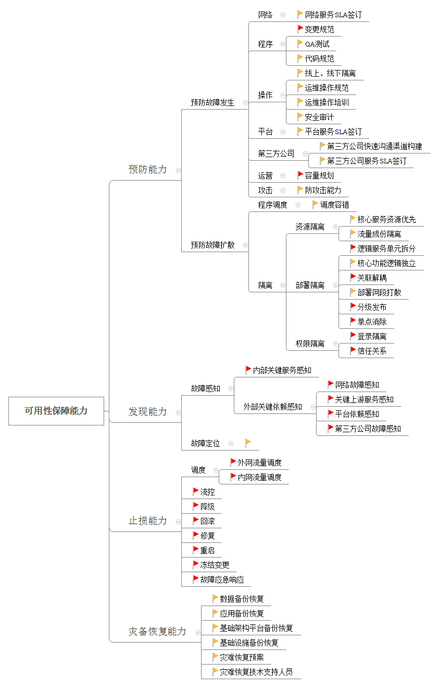
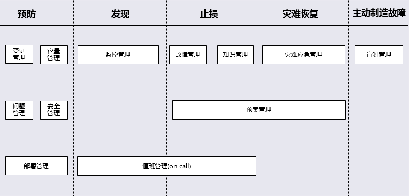

# code_style

<!-- vim-markdown-toc GFM -->

* [1 软件工程](#1-软件工程)
    * [1.1 一流代码的特性](#11-一流代码的特性)
    * [1.2 需求分析和系统设计的不同](#12-需求分析和系统设计的不同)
    * [1.3 项目开发流程图](#13-项目开发流程图)
* [2 需求分析及系统设计](#2-需求分析及系统设计)
    * [2.1 必须的文档](#21-必须的文档)
    * [2.2 文档编写](#22-文档编写)
        * [2.2.1 规范](#221-规范)
        * [2.2.2 模板](#222-模板)
* [3 代码编写](#3-代码编写)
    * [3.1 代码规范](#31-代码规范)
    * [3.2 Code review 步骤](#32-code-review-步骤)
    * [3.3 语义化版本](#33-语义化版本)
    * [3.4 如何维护更新日志](#34-如何维护更新日志)
    * [3.5 HTTP API 设计指南](#35-http-api-设计指南)
* [4 建议](#4-建议)
    * [程序员的技术能力模型](#程序员的技术能力模型)
* [5 可用性能力评估模型](#5-可用性能力评估模型)
    * [5.1 运维领域国际标准 ISO 20000](#51-运维领域国际标准-iso-20000)
    * [5.2 Google 可用性管理](#52-google-可用性管理)
* [6 其他](#6-其他)

<!-- vim-markdown-toc -->

## 1 软件工程

### 1.1 一流代码的特性
> * 高效（Fast）
> * 鲁棒（Solid and Robust）
> * 简洁（Maintainable and Simple）
> * 共享（Re-usable）
> * 可测试（Testable）
> * 可移植（Portable）
> * 可监控（Monitorable）
> * 可运维（Operational）
>   * 部署 Easy to deploy
>   * 变更 Easy to changes
>   * 维护 Easy to maintain
>   * 监控 Easy to observable
> * 可扩展（Scalable & Extensible）

### 1.2 需求分析和系统设计的不同

>   * 需求分析：定义系统 / 软件黑盒的行为（external,what）
>   * 系统设计：设计系统 / 软件白盒的机制（internal，how&why）

### 1.3 项目开发流程图

图放在首页刷图出来比较慢，就不放在首页了：-)

https://github.com/meetbill/code_style/wiki/development

## 2 需求分析及系统设计

文档是设计过程中使用的工具和设计过程的结果

### 2.1 必须的文档

凡是不那么“显而易见”的地方，最好都留下文档

> * 需求设计文档：需求，重点，取舍过程
> * 接口文档：函数，参数，返回值
> * 关键性的算法文档：思路，关键点
> * 系统总体框架：全局的思路

文档中不仅仅要留下来设计的结果（what），也要留下思考的过程（why）：留下决策的依据，便于后面的工作

### 2.2 文档编写

#### 2.2.1 规范
[需求分析和系统设计文档编写规范](./software/README.md )

#### 2.2.2 模板

* [需求分析](./software/MRD.md)
* [总体设计](./software/general_design.md)
* [详细设计](./software/detailed_design.md)

## 3 代码编写

### 3.1 代码规范

* [python](./python/README.md)

### 3.2 Code review 步骤

> * Step 1：系统全貌
>   * 模块划分的逻辑，模块之间的关系
> * Step 2：模块级别
>   * 看清模块内的逻辑
>   * 关键数据，关键的类、函数
> * Step 3：类、函数内部的逻辑
> * Step 4：细节
>   * Layout，命名，...

### 3.3 语义化版本

> [语义化版本控制规范](https://semver.org/lang/zh-CN/)
```
版本格式：主版本号。次版本号。修订号，版本号递增规则如下：
    主版本号：当你做了不兼容的 API 修改，
    次版本号：当你做了向下兼容的功能性新增，
    修订号：当你做了向下兼容的问题修正。
```

### 3.4 如何维护更新日志

> [Keep a Changelog](https://keepachangelog.com/zh-CN/1.0.0/)
```
指导原则
    记住日志是写给人的，而非机器。
    每个版本都应该有独立的入口。
    同类改动应该分组放置。
    版本与章节应该相互对应。
    新版本在前，旧版本在后。
    应包括每个版本的发布日期。
    注明是否遵守语义化版本格式。

变动类型
    Added 新添加的功能。
    Changed 对现有功能的变更。
    Deprecated 已经不建议使用，准备很快移除的功能。
    Removed 已经移除的功能。
    Fixed 对 bug 的修复
    Security 对安全的改进
```

### 3.5 HTTP API 设计指南

[HTTP API 设计指南](./http-api-design)

## 4 建议

不同种类的问题，有不同的模式，需要选用合适的表达模式

> * 分析和解决一个问题：提出问题，分析问题，解决问题
> * 提出一个实现的建议：出发点（目的），手段，工作量评估，收益的估计
> * 系统的设计：模块，功能，过程
> * 程序的设计：数据，函数，模块，调用过程，系统结构

### 程序员的技术能力模型

“编程语言 30% + 抽象能力（数据结构 50% + 对现实事实的抽象理解能力 10% + 设计模式能力 10%）70% = 100%。”

> * “认识到本质，才能让你的程序具备更大的灵活性和扩展性。在软件开发中，抽象能力体现为对问题域的理解能力，对领域模型的抽象。合理的抽象也是代码重构的前提，每一次重构，都是向更好的抽象迈进了一步。这是一个优秀高级程序员所应该具备的能力。”

例如：数据结构里经常提到的“抽象数据类型”，以时钟为例：时钟都有什么特点？可以显示时间；可以调时间。那么可以用这样的类型来抽象这个时钟：
```
class Clock
{
    int hour; // 表示时针
    int minute; // 表示分针
    int second; // 表示秒针
    getTime(); // 显示时间
    setTime(hour,mimute,second); // 调时间
}
```
## 5 可用性能力评估模型

> 可用性能力评估模型



> 可用性工程建设




### 5.1 运维领域国际标准 ISO 20000

1）ITIL：http://hci-itil.com
2）ISO 20000：https://www.iso.org

### 5.2 Google 可用性管理
《站点可靠性工程_Google 如何运行生产系统 -O'Reilly》

## 6 其他

[Google 的工程实践文档](https://google.github.io/eng-practices/)
